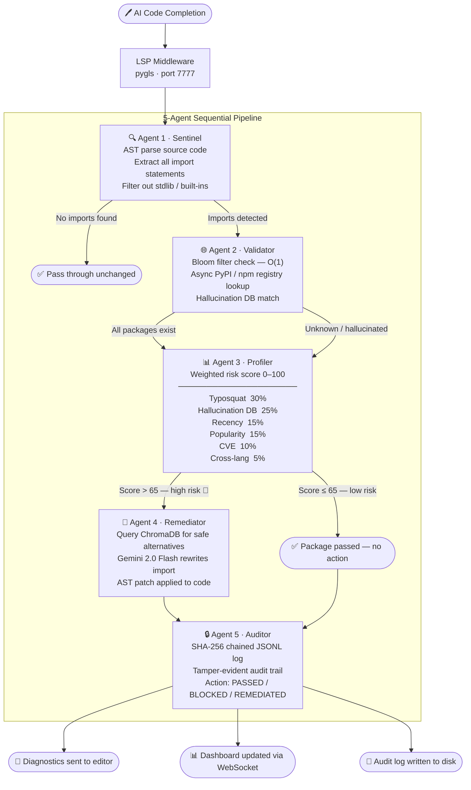

# HalluciGuard

[](https://python.org)
[](https://ai.google.dev)
[](https://microsoft.github.io/language-server-protocol/)
[](LICENSE)

**Real-time AI package hallucination detection for safer code generation.**

HalluciGuard is an editor-integrated security tool that detects suspicious, non-existent, and typo-like package imports commonly produced by AI coding assistants. It acts as a protective layer between generated code and the developer workflow, helping prevent supply-chain risks before unsafe dependencies enter a project.

---

## Problem

AI coding assistants can confidently generate imports for packages that do not exist, resemble popular packages, or belong to the wrong ecosystem. These hallucinated package names can become security risks if attackers later publish malicious packages under those names.

HalluciGuard addresses this risk by scanning code in real time and warning developers when an imported package appears unsafe or hallucinated.

---

## Solution

HalluciGuard runs as a Language Server Protocol (LSP) middleware for code editors. It analyzes imports from Python, JavaScript, and TypeScript files, validates package existence, scores risk, suggests safer alternatives, and records decisions in a tamper-evident audit trail.

```
Code Editor → HalluciGuard LSP → Detection Pipeline → Diagnostics + Dashboard + Audit Log
```

---

## Architecture

```
AI Code Completion
        │
        ▼
┌───────────────────┐
│   LSP Middleware  │  ← pygls on port 7777
│  (HalluciGuard)   │
└────────┬──────────┘
         │
         ▼
┌────────────────────────────────────────────────────┐
│              5-Agent Sequential Pipeline            │
│                                                    │
│  ┌──────────┐   ┌───────────┐   ┌──────────────┐  │
│  │ Sentinel │──▶│ Validator │──▶│   Profiler   │  │
│  │ Agent 1  │   │  Agent 2  │   │   Agent 3    │  │
│  │          │   │           │   │              │  │
│  │ AST parse│   │Bloom filter│  │ Risk score   │  │
│  │ & extract│   │+ registry │   │ 0-100 (6     │  │
│  │ imports  │   │   lookup  │   │  signals)    │  │
│  └──────────┘   └───────────┘   └──────┬───────┘  │
│                                         │          │
│  ┌──────────┐   ┌───────────┐           │          │
│  │  Auditor │◀──│Remediator │◀──────────┘          │
│  │ Agent 5  │   │  Agent 4  │                      │
│  │          │   │           │                      │
│  │ SHA-256  │   │ChromaDB + │                      │
│  │chain log │   │Gemini LLM │                      │
│  └──────────┘   └───────────┘                      │
└────────────────────────────────────────────────────┘
         │
         ▼
┌───────────────────┐
│  Flask Dashboard  │  ← Real-time UI on port 5050
│  (WebSocket)      │
└───────────────────┘
```

---

## Key Features

- **Real-time editor diagnostics** for suspicious imports
- **Python and JavaScript/TypeScript support** through AST-based import extraction
- **Package existence validation** using local indexes and live registry checks
- **Typosquatting detection** with Levenshtein distance against popular package names
- **Known hallucination detection** using a curated hallucination database
- **Risk scoring engine** combining multiple supply-chain risk signals
- **Safe package remediation suggestions** using similarity search and Gemini fallback rewriting
- **CVE awareness** through OSV.dev vulnerability lookups
- **Tamper-evident audit trail** using SHA-256 hash chaining
- **Live monitoring dashboard** for scan events, alerts, and audit visibility

---

## Detection Pipeline

HalluciGuard uses a five-agent sequential pipeline:

| Agent | Role | Tech |
| --- | --- | --- |
| **Sentinel** | Extracts imports, filters stdlib and built-ins | `tree-sitter`, `ast` |
| **Validator** | Checks package existence on PyPI/npm + hallucination DB | `pybloom-live`, `httpx` |
| **Profiler** | Computes a 0–100 risk score from multiple signals | `rapidfuzz`, `OSV.dev` |
| **Remediator** | Suggests safe alternatives, rewrites imports | `chromadb`, `google-adk` |
| **Auditor** | Records outcomes in a tamper-evident audit log | `canonicaljson`, `hashlib` |

### Five-Agent Flowchart



### Risk Signals

| Signal | Weight |
|--------|--------|
| Typosquat similarity (Levenshtein distance) | 30% |
| Known hallucination database match | 25% |
| Package recency (newly published = higher risk) | 15% |
| Popularity (download count on PyPI/npm) | 15% |
| Known CVEs via OSV.dev | 10% |
| Cross-ecosystem confusion | 5% |

> Packages scoring above **65/100** are flagged as high-risk and remediated.

---

## Example

```python
import requests        # ✅ real package — passes
import requets         # ⚠️  typo of requests — flagged
import securehashlib   # 🚨 known hallucination — blocked
import dataflow_engine # 🚨 non-existent — blocked
```

---

## Quick Start

### Prerequisites
- Python 3.11+
- [Gemini API key](https://aistudio.google.com/app/apikey) (free tier works)

### 1. Clone & Install

```bash
git clone https://github.com/your-username/HalluciGuard.git
cd HalluciGuard

python3 -m venv .venv
source .venv/bin/activate

pip install -r requirements.txt
```

### 2. Configure

```bash
cp .env.example .env
# Edit .env and set GEMINI_API_KEY=your-key-here
```

### 3. Seed Data (First Time Only)

```bash
python3 scripts/seed_bloom.py        # downloads 800k+ package names
python3 scripts/seed_chroma.py       # seeds safe-package vector store
python3 scripts/seed_hallucination_db.py
```

### 4. Run

```bash
python3 -m src.main --dashboard
```

| Service | Address |
|---------|---------|
| LSP Proxy | `tcp://localhost:7777` |
| Dashboard | `http://localhost:5050` |

---

## Demo Testing

Run the included demo script in a separate terminal:

```bash
python3 demo_test.py
```

Or test directly via the REST API:

```bash
curl -X POST http://localhost:5050/api/scan \
  -H "Content-Type: application/json" \
  -d '{"code": "import securehashlib\nimport requests", "language": "python"}'
```

---

## API Reference

### `POST /api/scan`

**Request:** `{ "code": "...", "language": "python" | "javascript" }`

**Response:**
```json
{
  "profiles": [{ "package_name": "securehashlib", "risk_score": 95.0, "is_high_risk": true }],
  "remediations": [{ "original_package": "securehashlib", "suggested_package": "hashlib" }],
  "patched_code": "import hashlib",
  "was_modified": true,
  "processing_time_ms": 342.1
}
```

### `GET /api/audit` — last 50 tamper-evident audit entries
### `GET /api/stats` — running counters (scans, flags, remediations, avg risk)

---

## Project Structure

```
src/
  core/
    lsp_proxy.py         # Editor-facing LSP server (port 7777)
    pipeline.py          # Five-agent orchestration
    config.py            # Risk weights, constants, env config
  agents/
    sentinel.py          # Import extraction
    validator.py         # Registry and hallucination checks
    profiler.py          # Risk scoring
    remediator.py        # Safe alternative suggestions
    auditor.py           # Hash-chained audit logging
  data/
    bloom_filter.py      # Fast O(1) package existence checks
    registry_client.py   # Async PyPI and npm validation
    cve_client.py        # OSV.dev vulnerability checks
    chroma_manager.py    # Safe-package similarity search
  utils/
    ast_parser.py        # Python and JavaScript import parsing
    levenshtein.py       # Typosquat detection
    hash_chain.py        # Audit integrity verification

dashboard/               # Flask + Socket.IO monitoring dashboard
vscode-extension/        # VS Code LSP client (TypeScript)
scripts/                 # Data seeding scripts
tests/                   # Automated test suite
demo_test.py             # Demo test runner
```

---

## Tech Stack

| Layer | Technology |
|---|---|
| Language Server | `pygls` (LSP) |
| AST Parsing | `tree-sitter`, Python `ast` |
| Package Validation | PyPI/npm APIs, `pybloom-live` |
| Typosquat Detection | `rapidfuzz` (Levenshtein) |
| Vulnerability Lookup | OSV.dev + SQLite cache |
| Safe Package RAG | `chromadb`, `sentence-transformers` |
| AI Remediation | Gemini 2.0 Flash (`google-adk`) |
| Audit Chain | `canonicaljson`, `hashlib` SHA-256 |
| Dashboard | `Flask`, `Flask-SocketIO` |
| Editor Extension | TypeScript (VS Code) |

---

## Running Tests

```bash
pytest
pytest -v
```

Known hallucinated packages: `securehashlib`, `dataflow_engine`, `crypto-helper`
Known safe packages: `flask`, `numpy`, `requests`

---

## Configuration

| Variable | Default | Description |
|----------|---------|-------------|
| `GEMINI_API_KEY` | — | Required for AI remediation |
| `HALLUCIGUARD_PORT` | `7777` | LSP server port |
| `RISK_THRESHOLD` | `65` | Score above which packages are blocked |
| `AUDIT_LOG_PATH` | `./audit_log.jsonl` | Tamper-evident audit log path |
| `DATA_DIR` | `./data` | Root for bloom/chroma/CVE data |

---

## Future Scope

- Authentication and access control for dashboard APIs
- Safer AST-based remediation instead of broad regex replacement
- Expanded ecosystem support: Go, Rust, Java
- CI/CD integration for PR-level hallucination scanning
- Pull request comments for risky generated dependencies
- Fine-tuned hallucination classifier to replace heuristic weights

---

## Team Note

HalluciGuard was built as a hackathon project to explore a growing software supply-chain problem: AI systems can invent dependencies, and those invented names can become real attack surfaces. The goal is to make that risk visible, actionable, and easy to catch during development.

---

## License

MIT License — see [LICENSE](LICENSE) for details.
