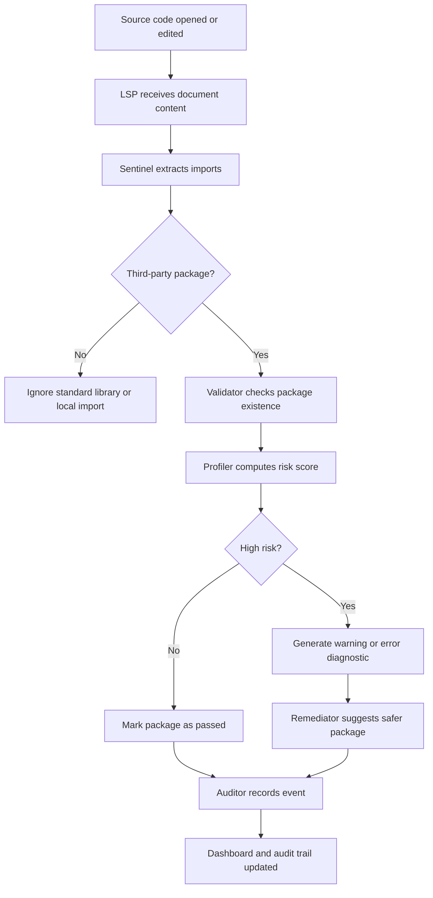

# HalluciGuard

[](https://python.org)
[](https://microsoft.github.io/language-server-protocol/)
[](#)
[](#)

**Real-time AI package hallucination detection for safer code generation.**

HalluciGuard is an editor-integrated security system that detects suspicious, non-existent, typo-like, and ecosystem-mismatched package imports commonly produced by AI coding assistants. It acts as a protective layer between AI-generated code and the developer workflow, helping prevent unsafe dependencies from entering a project unnoticed.

---

## Problem

AI coding assistants can generate code that looks syntactically correct but includes package names that do not actually exist. These hallucinated package names are especially dangerous because they often sound plausible, follow familiar naming patterns, or closely resemble trusted open-source libraries.

If developers copy, install, or commit these generated dependencies, attackers can exploit the gap by publishing malicious packages under those hallucinated names. This turns an AI generation error into a software supply-chain attack surface.

HalluciGuard addresses this problem by detecting risky package references at the moment they appear in the editor.

---

## Research Basis

HalluciGuard is grounded in research and industry concerns around AI-assisted development, package hallucination, and open-source supply-chain security.

### AI Package Hallucination

Large language models can generate dependency names that are syntactically plausible but unverified. In code generation tasks, the model may infer a package name from intent, naming conventions, or surrounding context rather than from actual registry existence. This creates a class of dependency errors that traditional syntax checks do not catch.

### Typosquatting

Typosquatting attacks rely on names that are visually or edit-distance similar to popular packages. A developer or model might generate `requets` instead of `requests`, or `numppy` instead of `numpy`. If attackers publish packages under those names, installation can lead to compromise.

### Dependency Confusion

Dependency confusion occurs when package resolution selects an unintended package source or name. Hallucinated package names can amplify this risk because they create demand for package identifiers that were never verified by the developer.

### Open-Source Supply-Chain Risk

Package trust is not binary. Useful security signals include existence, package age, popularity, ecosystem alignment, known vulnerabilities, and similarity to trusted packages. HalluciGuard combines these signals into a weighted risk score.

### Tamper-Evident Security Logging

Security tools should not only detect issues, but also preserve an audit trail. HalluciGuard records scan outcomes with hash chaining so detection and remediation events can be reviewed with integrity guarantees.

---

## Solution

HalluciGuard runs as a Language Server Protocol middleware between the code editor and the source file. It analyzes imports in real time, validates package references, computes risk, suggests safer alternatives, and reports results through editor diagnostics and a monitoring dashboard.

```text
Code Editor -> HalluciGuard LSP -> Detection Pipeline -> Diagnostics + Dashboard + Audit Log
```

The goal is to make AI-generated dependency risk visible before the developer installs, commits, or ships unsafe code.

---

## Key Features

- **Real-time editor diagnostics** for suspicious package imports.
- **Python and JavaScript/TypeScript support** through AST-based import extraction.
- **Package existence validation** using local indexes and live registry checks.
- **Typosquatting detection** using Levenshtein distance against popular packages.
- **Known hallucination detection** through a curated hallucination database.
- **Weighted risk scoring** across multiple supply-chain security signals.
- **Safe package suggestions** using similarity search and remediation logic.
- **CVE awareness** through OSV.dev vulnerability lookups.
- **Tamper-evident audit logging** using SHA-256 hash chaining.
- **Live dashboard telemetry** for scan visibility and security events.

---

## System Architecture

```text
                       +----------------------+
                       |   VS Code Extension  |
                       |   LSP Client Layer   |
                       +----------+-----------+
                                  |
                                  v
                       +----------------------+
                       |  HalluciGuard LSP    |
                       |  Real-Time Scanner   |
                       +----------+-----------+
                                  |
                                  v
        +-------------+-----------+-----------+-------------+
        |             |           |           |             |
        v             v           v           v             v
   Sentinel      Validator    Profiler   Remediator     Auditor
 Import ASTs    Registries   Risk Score  Safe Fixes   Hash Chain
        |             |           |           |             |
        +-------------+-----------+-----------+-------------+
                                  |
                                  v
                   +-------------------------------+
                   | Diagnostics + Dashboard Events |
                   +-------------------------------+
```

HalluciGuard is organized into three major layers.

### 1. Editor Integration Layer

The VS Code extension acts as the client interface. It connects to the HalluciGuard language server and receives diagnostics that appear directly in the developer's editor. This makes hallucinated dependency detection part of the normal coding flow rather than a separate security step.

### 2. Detection Pipeline Layer

The detection pipeline is a five-agent sequential system:

| Agent | Responsibility |
| --- | --- |
| **Sentinel** | Parses source code, extracts imports, filters standard library and built-in modules |
| **Validator** | Checks package existence across package indexes, registries, and hallucination data |
| **Profiler** | Computes a 0-100 risk score using supply-chain risk signals |
| **Remediator** | Suggests safer alternatives and possible package replacements |
| **Auditor** | Records scan decisions in a tamper-evident hash-chained log |

### 3. Intelligence and Data Layer

The pipeline uses multiple data sources and analysis methods:

| Component | Purpose |
| --- | --- |
| **Bloom Filter** | Fast local package existence checks |
| **PyPI / npm Registry Clients** | Live package validation |
| **Hallucination Database** | Known AI-generated suspicious package names |
| **Levenshtein Similarity** | Typosquat and near-name detection |
| **OSV.dev Client** | Known vulnerability lookup |
| **ChromaDB Store** | Similarity-based safe package retrieval |
| **Hash Chain Utility** | Audit log integrity verification |

---

## Detection Flow



---

## Risk Model

HalluciGuard assigns each package a weighted risk score from `0` to `100`.

| Signal | Why It Matters |
| --- | --- |
| **Package does not exist** | Strong indicator of hallucination or unresolved dependency |
| **Near match to popular package** | Suggests typo or typosquatting risk |
| **Known hallucination match** | Package appears in curated hallucination patterns |
| **New or low-popularity package** | Recently published or obscure packages carry higher risk |
| **Cross-ecosystem mismatch** | Example: importing npm-style packages in Python |
| **Known vulnerabilities** | Existing CVEs increase package risk |

The score determines whether a package is treated as safe, suspicious, or high-risk.

---

## Example

```python
import requests
import requets
import securehashlib
import dataflow_engine
```

Expected interpretation:

| Import | Result |
| --- | --- |
| `requests` | Real package, low risk |
| `requets` | Likely typo of `requests` |
| `securehashlib` | Known hallucinated package pattern |
| `dataflow_engine` | Suspicious or non-existent dependency |

---

## Codebase Architecture

```text
src/core/
  lsp_proxy.py       # Editor-facing LSP server
  pipeline.py        # Five-agent orchestration
  config.py          # Risk weights and constants

src/agents/
  sentinel.py        # Import extraction
  validator.py       # Registry and hallucination checks
  profiler.py        # Risk scoring
  remediator.py      # Safe alternative suggestions
  auditor.py         # Hash-chained audit logging

src/data/
  bloom_filter.py    # Fast package existence checks
  registry_client.py # PyPI and npm validation
  cve_client.py      # OSV.dev vulnerability checks
  chroma_manager.py  # Safe-package similarity search

src/utils/
  ast_parser.py      # Python and JavaScript import parsing
  levenshtein.py     # Typosquat detection
  hash_chain.py      # Audit integrity verification

dashboard/           # Monitoring dashboard
vscode-extension/    # VS Code LSP client
tests/               # Automated test suite
```

---

## Technical Stack

| Layer | Technology |
| --- | --- |
| Language Server | pygls, LSP |
| Import Parsing | Python AST, Tree-sitter |
| Package Validation | PyPI API, npm Registry API |
| Fast Lookup | Bloom filter |
| Similarity Detection | RapidFuzz, Levenshtein distance |
| Vulnerability Intelligence | OSV.dev |
| Safe Package Retrieval | ChromaDB |
| Remediation | Gemini-assisted rewrite with fallback logic |
| Dashboard | Flask, Flask-SocketIO |
| Extension | TypeScript, VS Code Language Client |
| Audit Integrity | SHA-256, canonical JSON |

---

## Demo Impact

HalluciGuard demonstrates how AI-generated dependency risk can be detected during development rather than after installation or deployment.

It is useful for:

- Catching hallucinated package names from AI-generated code.
- Preventing typo-style dependency mistakes.
- Surfacing package risk directly inside the editor.
- Giving security teams an auditable record of dependency decisions.
- Encouraging safer use of AI coding assistants in real software projects.

---

## Current Status

- Python test suite passes locally.
- VS Code extension compiles.
- npm dependency audit reports no known vulnerabilities.
- Dashboard is intended for local demo use and is not production-hardened.

---

## Future Scope

- Authentication and access control for dashboard APIs.
- Safer AST-based remediation instead of broad text replacement.
- Expanded ecosystem support for Go, Rust, Java, and Ruby.
- CI/CD integration for pull request scanning.
- Risk explanations with citations and confidence scores.
- Organization-level hallucination intelligence database.

---

## Team Note

HalluciGuard was built as a hackathon project to explore a growing software supply-chain problem: AI systems can invent dependencies, and those invented names can become real attack surfaces. The goal is to make that risk visible, actionable, and easy to catch during development.
