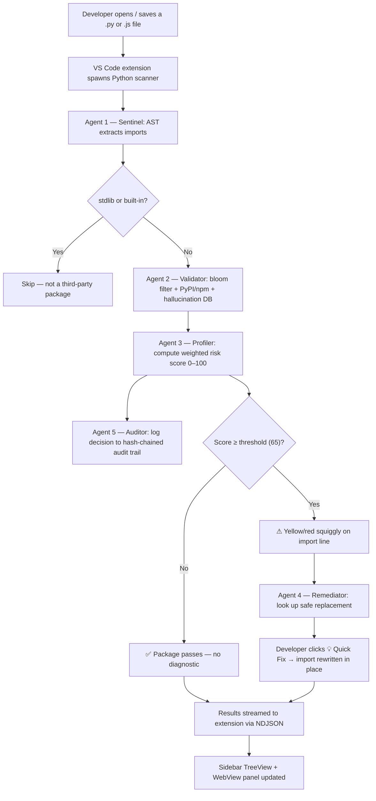

# HalluciGuard

[](https://python.org)
[](https://typescriptlang.org)
[](https://code.visualstudio.com)
[](#)
[](#)
[](#license)

> **Google India Hackathon 2025**

**Real-time AI package hallucination detection, directly inside your editor.**

HalluciGuard is a VS Code extension that catches hallucinated, typosquatted, and non-existent package imports in AI-generated code — before they become a supply-chain attack surface. It runs a 5-agent Python scanner in the background, shows inline squiggly-line diagnostics, and offers one-click Quick Fix remediations, all without leaving your editor.

---

## The Problem

AI coding assistants (Copilot, Cursor, ChatGPT) frequently generate `import` statements for packages that **do not exist**. These hallucinated names are dangerous because:

- They sound plausible and follow real naming conventions
- Attackers actively monitor for hallucinated names and register malicious packages under them
- Traditional linters and type-checkers cannot catch them — the syntax is valid

HalluciGuard closes this gap by validating every import against 802,000+ known packages, a curated hallucination database, and live PyPI/npm registry checks — at the moment the code is written.

---

## Research Foundation

| Threat | Research Basis |
| --- | --- |
| AI package hallucination | Lanyado et al., *"Can You Trust ChatGPT's Package Recommendations?"* (2023) |
| Typosquatting risk | Vu et al., *MalOSS*, ICSE 2020 |
| Supply-chain attack taxonomy | Ohm et al., *"Backstabber's Knife Collection"* (2020) |
| Risk signal weighting | Spracklen et al., *"We Have a Package for You!"*, USENIX Security 2025 |
| Vulnerability intelligence | OSV.dev open vulnerability database |

---

## Key Features

| Feature | Details |
| --- | --- |
| **Inline diagnostics** | Yellow (WARN) and red (BLOCK) squiggly lines directly on the import statement |
| **5-agent detection pipeline** | Sentinel → Validator → Profiler → Remediator → Auditor |
| **802k package bloom filter** | Sub-millisecond local existence check, no network needed |
| **Live registry validation** | Async PyPI + npm API checks for bloom filter misses |
| **Weighted risk scoring** | 0–100 score across 6 supply-chain signals |
| **One-click Quick Fix** | Remediator replaces hallucinated import with the correct package |
| **CVE awareness** | OSV.dev vulnerability lookup with 24-hour SQLite cache |
| **Tamper-evident audit log** | SHA-256 hash-chained JSONL log of every scan decision |
| **Sidebar TreeView** | Hierarchical results: File → Package → Risk signals → Jump to line |
| **Rich WebView panel** | Animated risk gauge (0–100 arc) per package with full signal breakdown |
| **Python + JavaScript** | AST-based import extraction for both ecosystems |

---

## System Architecture

```text
┌─────────────────────────────────────────────────────────┐
│                  VS Code Extension                       │
│             (TypeScript — editor layer)                  │
│  Status Bar · Sidebar TreeView · Inline Diagnostics      │
│  Quick Fix Actions · Rich WebView Panel                  │
└──────────────────────┬──────────────────────────────────┘
                       │  spawn subprocess + read NDJSON stdout
                       ▼
┌─────────────────────────────────────────────────────────┐
│            Bundled Python Scanner                        │
│         halluciguard_scanner.py  (CLI)                   │
│   Streams one JSON object per line to stdout             │
└──────────────────────┬──────────────────────────────────┘
                       │
          ┌────────────▼────────────┐
          │   5-Agent Pipeline       │
          └────────────┬────────────┘
                       │
     ┌─────────────────┼──────────────────────┐
     │                 │                      │
     ▼                 ▼                      ▼
┌─────────┐      ┌──────────┐         ┌──────────┐
│ Agent 1 │      │ Agent 2  │         │ Agent 3  │
│Sentinel │─────▶│Validator │────────▶│ Profiler │
│AST Parse│      │Bloom+API │         │Risk 0-100│
└─────────┘      └──────────┘         └─────┬────┘
                                            │
                              ┌─────────────┴─────────────┐
                              │                           │
                              ▼                           ▼
                       ┌──────────┐               ┌──────────┐
                       │ Agent 4  │               │ Agent 5  │
                       │Remediator│               │ Auditor  │
                       │Quick Fix │               │Hash Chain│
                       └──────────┘               └──────────┘
                              │                           │
                              ▼                           ▼
                    ┌──────────────────┐    ┌─────────────────────┐
                    │  Editor Diagnostics│   │  audit_log.jsonl    │
                    │  + Sidebar Results │   │  (tamper-evident)   │
                    └──────────────────┘    └─────────────────────┘
```

### Layer 1 — VS Code Extension (TypeScript)

Manages the editor experience. Spawns the Python scanner as a subprocess, parses the NDJSON result stream, and renders findings as inline squiggly lines, a sidebar TreeView, and a rich WebView panel. Registers Quick Fix code actions for one-click import remediation.

### Layer 2 — Python Scanner (Bundled)

A self-contained CLI (`halluciguard_scanner.py`) that walks a workspace, runs the 5-agent pipeline on every `.py` and `.js` file, and streams results to stdout as NDJSON. No external server. No API keys.

### Layer 3 — 5-Agent Detection Pipeline

| # | Agent | Role | Status |
| --- | --- | --- | --- |
| 1 | **Sentinel** | AST-parses source code, extracts all imports, filters Python stdlib and JS built-ins | ✅ |
| 2 | **Validator** | Bloom filter check (O(1)) → async PyPI/npm API → hallucination DB match | ✅ |
| 3 | **Profiler** | Computes weighted 0–100 risk score across 6 supply-chain signals | ✅ |
| 4 | **Remediator** | Looks up curated safe replacement, surfaces as VS Code Quick Fix code action | ✅ |
| 5 | **Auditor** | Writes every scan decision to a SHA-256 hash-chained JSONL audit log | ✅ |

### Layer 4 — Intelligence & Data

| Component | Purpose |
| --- | --- |
| **Bloom Filter** | 802,360 PyPI + npm package names, 0.1% FP rate, O(1) lookup |
| **Hallucination Database** | 77+ curated names known to be hallucinated by LLMs |
| **Remediation Map** | 80+ curated safe replacements keyed to known hallucinations |
| **Registry Clients** | Async `httpx` HTTP/2 clients for PyPI JSON API and npm registry |
| **Levenshtein Engine** | `rapidfuzz` distance against 600+ popular packages for typosquat detection |
| **CVE Client** | OSV.dev API with SQLite cache (24-hour TTL) |
| **Hash Chain** | SHA-256 per-entry with `prev_hash` linkage; `verify_integrity()` checks full chain |

---

## Detection Flow



---

## Risk Scoring Model

Every package receives a weighted risk score from `0` to `100`.

| Signal | Weight | Trigger Condition |
| --- | --- | --- |
| **Typosquat distance** | 30 | Levenshtein distance ≤ 2 from a popular package |
| **Hallucination DB hit** | 25 | Exact match in curated hallucination database |
| **Not on any registry** | 25 | Absent from PyPI and npm after live check |
| **New / low-popularity** | 15 | Package age < 90 days or download count < 1,000 |
| **Known vulnerabilities** | 10 | CVE found via OSV.dev |
| **Cross-ecosystem mismatch** | 5 | npm package imported in Python (or vice versa) |

**Thresholds:** `ALLOW` < 65 · `WARN` ≥ 65 · `BLOCK` ≥ 80

---

## Scanner NDJSON Protocol

The Python scanner streams one JSON object per line to stdout. The extension parses this stream in real time.

```jsonc
// Progress — one per file as it starts scanning
{"type": "progress", "file": "src/auth.py", "status": "scanning"}

// Finding — one per flagged package
{"type": "finding", "file": "src/auth.py", "package": "securehashlib", "line": 2,
 "risk_score": 68.0, "action": "WARN", "flags": ["HALLUCINATION_DB_HIT", "NOT_IN_REGISTRY"],
 "nearest": "hashlib", "distance": 6, "suggested": "cryptography", "language": "python"}

// Summary — final line after all files scanned
{"type": "summary", "files_scanned": 3, "packages_found": 11, "high_risk": 5, "passed": 6, "duration_ms": 1887}

// Audit summary — chain integrity report
{"type": "audit_summary", "entries_logged": 11, "chain_valid": true}
```

`action` values: `BLOCK` (score ≥ 80) · `WARN` (score ≥ 65) · `ALLOW` (score < 65)

---

## Demo

The `demo_workspace/` directory contains realistic AI-generated code seeded with hallucinated imports.

```python
# src/auth.py — 2 hallucinations
import securehashlib      # ⚠ risk 68  →  suggested: cryptography
import dataflow_engine    # ⚠ risk 68  →  suggested: apache-beam
import requests           # ✅ real package — passes

# src/utils.py — 2 hallucinations
import crypto_helper      # ⚠ risk 69  →  suggested: cryptography
from logmanager import Logger  # ⚠ risk 69  →  suggested: loguru
import numpy as np        # ✅ real package — passes
```

```javascript
// frontend/index.js — 1 hallucination
const secureFetch = require('secure-fetch-utils');  // ⚠ risk 68  →  suggested: axios
const axios = require('axios');   // ✅ real — passes
const _ = require('lodash');      // ✅ real — passes
```

**Verified:** 5 hallucinations flagged · 6 real packages pass · 0 false positives

### Run via CLI

```bash
git clone https://github.com/Quantum-Blade1/HalluciGuard.git
cd HalluciGuard
python -m venv .venv && source .venv/bin/activate
pip install -r scanner/requirements.txt
python scanner/halluciguard_scanner.py --workspace demo_workspace/
```

### Run via VS Code Extension

```bash
cd vscode-extension
npm install && npm run compile
# In VS Code: Run → Start Debugging → Run Extension (Fn+F5)
# In the new window: File → Open Folder → demo_workspace/
# Command Palette → HalluciGuard: Scan Workspace
```

---

## Installation

**Requirements:** VS Code 1.85+ · Python 3.9+ · pip

```bash
git clone https://github.com/Quantum-Blade1/HalluciGuard.git
cd HalluciGuard/vscode-extension
npm install
npm run compile
```

Press **Fn+F5** in VS Code to open the Extension Development Host. On first activation, the extension automatically installs:

```
tree-sitter  ·  tree-sitter-python  ·  tree-sitter-javascript
httpx[http2]  ·  rapidfuzz  ·  pybloom-live
```

---

## Settings

| Setting | Default | Description |
|---|---|---|
| `halluciguard.riskThreshold` | `65` | Minimum risk score to flag a package |
| `halluciguard.autoScanOnSave` | `false` | Auto-scan on every file save |
| `halluciguard.pythonPath` | `python3` | Path to Python interpreter |
| `halluciguard.showPassedPackages` | `false` | Show safe packages in sidebar |

---

## Project Structure

```text
HalluciGuard/
├── vscode-extension/              # TypeScript VS Code extension
│   ├── src/
│   │   ├── extension.ts           # Activation, commands, status bar
│   │   ├── scanner_bridge.ts      # Subprocess spawn + NDJSON stream parser
│   │   ├── diagnostics.ts         # DiagnosticCollection + Quick Fix provider
│   │   ├── results_provider.ts    # Sidebar TreeDataProvider
│   │   └── webview_panel.ts       # Rich results WebView with risk gauge
│   ├── scanner/                   # Bundled Python scanner (shipped in .vsix)
│   │   ├── halluciguard_scanner.py
│   │   ├── agents/
│   │   │   ├── sentinel.py        # Agent 1 — import extraction
│   │   │   ├── validator.py       # Agent 2 — bloom + registry + hallucination DB
│   │   │   ├── profiler.py        # Agent 3 — risk scoring
│   │   │   └── auditor.py         # Agent 5 — hash-chained audit log
│   │   ├── data/
│   │   │   ├── bloom_filter.py
│   │   │   ├── registry_client.py
│   │   │   ├── hallucination_db.py
│   │   │   └── cve_client.py
│   │   └── utils/
│   │       ├── ast_parser.py
│   │       ├── levenshtein.py
│   │       ├── module_to_package.py
│   │       └── hash_chain.py      # SHA-256 chain utility
│   └── data/
│       ├── bloom/                 # 802k PyPI + npm package name lists
│       └── hallucination_db/      # known_hallucinations.json
│
├── scanner/                       # Source copy of bundled scanner (dev reference)
├── demo_workspace/                # Demo files with hallucinated imports
├── dashboard/                     # Standalone Flask monitoring dashboard (optional)
├── tests/                         # pytest test suite
└── scripts/                       # Bloom filter + hallucination DB seed scripts
```

---

## Technical Stack

| Layer | Technology |
| --- | --- |
| VS Code Extension | TypeScript 5.3, VS Code Extension API 1.85 |
| Import Parsing | Python `ast` module + Tree-sitter (Python + JS) |
| Package Validation | PyPI JSON API, npm Registry API |
| Fast Lookup | `pybloom-live` — 802k packages, 0.1% FP rate |
| Similarity Detection | `rapidfuzz` Levenshtein distance |
| Vulnerability Intelligence | OSV.dev API + SQLite cache (24h TTL) |
| Scanner Protocol | NDJSON streaming over stdout |
| Audit Integrity | SHA-256 + canonical JSON hash chaining |
| Standalone LSP | `pygls`, Language Server Protocol |
| Dashboard | Flask, Flask-SocketIO |

---

## Current Status

| Component | Status |
| --- | --- |
| CLI scanner | ✅ Fully working |
| VS Code extension | ✅ Fully working |
| Agent 1 — Sentinel (import extraction) | ✅ Fully working |
| Agent 2 — Validator (bloom + registry) | ✅ Fully working |
| Agent 3 — Profiler (risk scoring) | ✅ Fully working |
| Agent 4 — Remediator (Quick Fix) | ✅ Fully working |
| Agent 5 — Auditor (hash-chain log) | ✅ Fully working · `chain_valid: true` verified |
| Inline squiggly diagnostics | ✅ Fully working |
| Sidebar TreeView | ✅ Fully working |
| Rich WebView panel with risk gauge | ✅ Fully working |
| Demo workspace | ✅ 5 flagged · 6 passed · 0 false positives |
| Bloom filter (802k packages) | ✅ Loaded and indexed |
| Hallucination DB (77+ entries) | ✅ Active |
| Remediation map (80+ curated fixes) | ✅ Active |
| CVE lookup via OSV.dev | ✅ Working with SQLite cache |
| Standalone Flask dashboard | ✅ Working (not production-hardened) |

---

## Future Scope

- VS Code Marketplace publish
- AST-aware import rewriting (preserve aliases and `from X import Y` style)
- Expanded ecosystem support — Go, Rust, Java, Ruby
- CI/CD integration for pull request scanning
- Risk explanations with confidence scores and paper citations
- Organization-level private hallucination intelligence feed

---

## Team

Built at the **Google India Hackathon 2025** to tackle a growing threat: AI systems invent package names, and those invented names become real attack vectors the moment an attacker registers them. Our goal was to make that risk visible, actionable, and easy to fix — without adding friction to the developer workflow.

<table>
  <tr>
    <td align="center" width="33%">
      <a href="https://github.com/aanya0-07">
        
        <br/><br/>
        <b>Aanya Singh</b>
      </a>
      <br/>
      <a href="https://github.com/aanya0-07">@aanya0-07</a>
      <br/><br/>
      <sub>
        Research & risk model design.<br/>
        Validator agent (bloom filter +<br/>
        registry + hallucination DB).<br/>
        Profiler agent — risk scoring<br/>
        weights and signal calibration.<br/>
        Hallucination database curation.
      </sub>
    </td>
    <td align="center" width="33%">
      <a href="https://github.com/shashankyamme-code">
        
        <br/><br/>
        <b>Shashank Yamme</b>
      </a>
      <br/>
      <a href="https://github.com/shashankyamme-code">@shashankyamme-code</a>
      <br/><br/>
      <sub>
        VS Code extension (TypeScript).<br/>
        Sidebar TreeView, inline diagnostics,<br/>
        Quick Fix code actions.<br/>
        Rich WebView panel with<br/>
        animated risk gauge.<br/>
        Extension UX and settings system.
      </sub>
    </td>
    <td align="center" width="33%">
      <a href="https://github.com/Quantum-Blade1">
        
        <br/><br/>
        <b>Krish Kumar Sharma</b>
      </a>
      <br/>
      <a href="https://github.com/Quantum-Blade1">@Quantum-Blade1</a>
      <br/><br/>
      <sub>
        Project lead & core architecture.<br/>
        Sentinel agent (AST import parsing).<br/>
        Remediator (curated fix map).<br/>
        Auditor (SHA-256 hash chain).<br/>
        Scanner CLI + NDJSON protocol.<br/>
        Flask dashboard & LSP proxy.
      </sub>
    </td>
  </tr>
</table>

---

## License

MIT © 2025 HalluciGuard Team — Aanya Singh · Shashank Yamme · Krish Kumar Sharma
