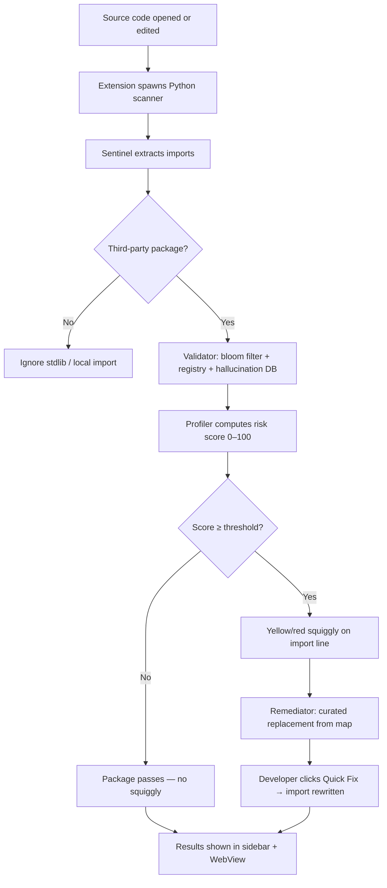

# HalluciGuard

[](https://python.org)
[](https://microsoft.github.io/language-server-protocol/)
[](#)
[](#)

**Real-time AI package hallucination detection for safer code generation.**

HalluciGuard is an editor-integrated security system that detects suspicious, non-existent, typo-like, and ecosystem-mismatched package imports commonly produced by AI coding assistants. It acts as a protective layer between AI-generated code and the developer workflow, helping prevent unsafe dependencies from entering a project unnoticed.

> **Google India Hackathon 2025 Project**

---

## Problem

AI coding assistants can generate code that looks syntactically correct but includes package names that do not actually exist. These hallucinated package names are especially dangerous because they often sound plausible, follow familiar naming patterns, or closely resemble trusted open-source libraries.

If developers copy, install, or commit these generated dependencies, attackers can exploit the gap by publishing malicious packages under those hallucinated names. This turns an AI generation error into a software supply-chain attack surface.

HalluciGuard addresses this problem by detecting risky package references at the moment they appear in the editor.

---

## Research Basis

HalluciGuard is grounded in research and industry concerns around AI-assisted development, package hallucination, and open-source supply-chain security.

### AI Package Hallucination

Large language models can generate dependency names that are syntactically plausible but unverified. In code generation tasks, the model may infer a package name from intent, naming conventions, or surrounding context rather than from actual registry existence. This creates a class of dependency errors that traditional syntax checks do not catch.

### Typosquatting

Typosquatting attacks rely on names that are visually or edit-distance similar to popular packages. A developer or model might generate `requets` instead of `requests`, or `numppy` instead of `numpy`. If attackers publish packages under those names, installation can lead to compromise.

### Dependency Confusion

Dependency confusion occurs when package resolution selects an unintended package source or name. Hallucinated package names can amplify this risk because they create demand for package identifiers that were never verified by the developer.

### Open-Source Supply-Chain Risk

Package trust is not binary. Useful security signals include existence, package age, popularity, ecosystem alignment, known vulnerabilities, and similarity to trusted packages. HalluciGuard combines these signals into a weighted risk score.

### Tamper-Evident Security Logging

Security tools should not only detect issues, but also preserve an audit trail. HalluciGuard records scan outcomes with hash chaining so detection and remediation events can be reviewed with integrity guarantees.

---

## Solution

HalluciGuard runs as a VS Code extension with a bundled Python scanner. It analyzes imports in real time, validates package references, computes risk, suggests safer alternatives, and reports results through editor diagnostics.

```text
Code Editor → HalluciGuard Extension → Python Scanner → Detection Pipeline → Diagnostics + Quick Fix
```

The goal is to make AI-generated dependency risk visible before the developer installs, commits, or ships unsafe code.

---

## Key Features

- **Real-time editor diagnostics** — yellow/red squiggly lines on suspicious package imports.
- **Python and JavaScript support** through AST-based import extraction.
- **Package existence validation** using local bloom filter (802k packages) and live registry checks.
- **Typosquatting detection** using Levenshtein distance against 600+ popular packages.
- **Known hallucination detection** through a curated hallucination database (77+ entries).
- **Weighted risk scoring** across 6 supply-chain security signals (0–100).
- **One-click Quick Fix** — Remediator suggests and applies the correct package replacement.
- **CVE awareness** through OSV.dev vulnerability lookups with SQLite caching.
- **Sidebar TreeView** — hierarchical results: File → Package → Risk details → Jump to line.
- **Rich WebView panel** — animated risk gauge per package with signal breakdown.
- **Works offline** — bloom filter check requires no network; registry check is best-effort.

---

## System Architecture

```text
                       +----------------------+
                       |   VS Code Extension  |
                       |  (TypeScript Layer)  |
                       +----------+-----------+
                                  |
                                  v
                       +----------------------+
                       |  Bundled Python       |
                       |  Scanner (NDJSON)     |
                       +----------+-----------+
                                  |
                                  v
        +-------------+-----------+-----------+
        |             |           |           |
        v             v           v           v
   Sentinel      Validator    Profiler   Remediator
 Import ASTs    Registries   Risk Score  Quick Fix
        |             |           |           |
        +-------------+-----------+-----------+
                                  |
                                  v
                   +-------------------------------+
                   |  Inline Diagnostics + Sidebar  |
                   +-------------------------------+
```

HalluciGuard is organized into three major layers.

### 1. Editor Integration Layer

The VS Code extension acts as the client interface. It spawns a bundled Python scanner subprocess and receives NDJSON results streamed to stdout. Diagnostics appear directly in the developer's editor as inline squiggly lines and a sidebar panel, making hallucinated dependency detection part of the normal coding flow.

### 2. Detection Pipeline Layer

The detection pipeline is a four-agent sequential system (v1):

| Agent | Responsibility | Status |
| --- | --- | --- |
| **Sentinel** | Parses source code, extracts imports, filters stdlib and built-ins | ✅ Working |
| **Validator** | Checks package existence via bloom filter, PyPI/npm APIs, and hallucination DB | ✅ Working |
| **Profiler** | Computes a 0–100 risk score using 6 weighted supply-chain signals | ✅ Working |
| **Remediator** | Suggests curated safe replacements, applies one-click Quick Fix in editor | ✅ Working |
| **Auditor** | SHA-256 hash-chained JSONL audit log — every scan decision logged with `chain_valid` verification | ✅ Working |

### 3. Intelligence and Data Layer

| Component | Purpose |
| --- | --- |
| **Bloom Filter** | Fast local package existence checks (802k PyPI + npm packages) |
| **PyPI / npm Registry Clients** | Live async package validation via httpx |
| **Hallucination Database** | 77+ curated AI-generated suspicious package names |
| **Remediation Map** | 80+ curated safe replacements for known hallucinations |
| **Levenshtein Similarity** | Typosquat and near-name detection via rapidfuzz |
| **OSV.dev Client** | Known CVE vulnerability lookup with 24h SQLite cache |

---

## Detection Flow



---

## Risk Model

HalluciGuard assigns each package a weighted risk score from `0` to `100`.

| Signal | Weight | Why It Matters |
| --- | --- | --- |
| **Typosquat distance** | 30 | Near match to popular package suggests squatting risk |
| **Hallucination DB hit** | 25 | Package appears in curated hallucination patterns |
| **Not on any registry** | 25 | Strong indicator of hallucination or unresolved dependency |
| **New or low-popularity** | 15 | Recently published or obscure packages carry higher risk |
| **Cross-ecosystem mismatch** | 5 | Importing npm-style packages in Python (or vice versa) |
| **Known vulnerabilities** | 10 | Existing CVEs increase package risk |

The default threshold is **65**. Packages scoring ≥ 65 are flagged (WARN); ≥ 80 are blocked (BLOCK).

---

## Demo

The `demo_workspace/` directory contains realistic AI-generated code with hallucinated imports:

```python
# src/auth.py
import securehashlib      # ⚠ hallucinated — risk 68 → suggested: cryptography
import dataflow_engine    # ⚠ hallucinated — risk 68 → suggested: apache-beam
import requests           # ✅ real package — passes

# src/utils.py
import crypto_helper      # ⚠ hallucinated — risk 69 → suggested: cryptography
from logmanager import Logger  # ⚠ hallucinated — risk 69 → suggested: loguru
import numpy as np        # ✅ real package — passes
```

```javascript
// frontend/index.js
const secureFetch = require('secure-fetch-utils');  // ⚠ hallucinated — risk 68 → suggested: axios
const axios = require('axios');   // ✅ real package — passes
```

**Verified results:** 5 hallucinations flagged · 6 real packages pass · 0 false positives

### Running the CLI scanner

```bash
source .venv/bin/activate
python scanner/halluciguard_scanner.py --workspace demo_workspace/
```

### Running the VS Code extension

```bash
cd vscode-extension
npm install && npm run compile
# Press F5 (or Run → Start Debugging → Run Extension) in VS Code
# Open demo_workspace/ in the new window → View → Command Palette → HalluciGuard: Scan Workspace
```

---

## Installation

### From Source (dev)

```bash
git clone https://github.com/Quantum-Blade1/HalluciGuard.git
cd HalluciGuard/vscode-extension
npm install
npm run compile
# Press F5 in VS Code to launch Extension Development Host
```

### Requirements

- VS Code 1.85+
- Python 3.9+ on your PATH (`python3` or configured via `halluciguard.pythonPath` setting)
- pip (for first-run dependency install)

On first activation the extension installs:
```bash
pip install -r scanner/requirements.txt
# tree-sitter, httpx[http2], rapidfuzz, pybloom-live
```

---

## Usage

| Action | How |
|---|---|
| Scan workspace | Activity Bar shield icon → click **Scan Workspace** |
| Scan current file | Command Palette → `HalluciGuard: Scan Current File` |
| View results | Activity Bar → HalluciGuard sidebar |
| Rich panel | Command Palette → `HalluciGuard: Show Results Panel` |
| Clear all results | Command Palette → `HalluciGuard: Clear Results` |

### Settings

| Setting | Default | Description |
|---|---|---|
| `halluciguard.riskThreshold` | `65` | Minimum score to flag a package |
| `halluciguard.autoScanOnSave` | `false` | Auto-scan on file save |
| `halluciguard.pythonPath` | `python3` | Path to Python interpreter |
| `halluciguard.showPassedPackages` | `false` | Show safe packages in sidebar |

---

## Codebase Structure

```text
vscode-extension/
  src/
    extension.ts         # Activate/deactivate, commands, status bar
    scanner_bridge.ts    # Spawns Python subprocess, parses NDJSON stream
    results_provider.ts  # Sidebar TreeView (File → Package → Flags)
    diagnostics.ts       # Inline squiggly lines + Quick Fix actions
    webview_panel.ts     # Rich results WebView with risk gauge

scanner/                 # Bundled Python scanner (also at vscode-extension/scanner/)
  halluciguard_scanner.py  # CLI entry — streams NDJSON to stdout
  agents/
    sentinel.py          # Import extraction
    validator.py         # Registry and hallucination checks
    profiler.py          # Risk scoring
  data/
    bloom_filter.py      # Fast package existence checks
    registry_client.py   # PyPI and npm validation
    cve_client.py        # OSV.dev vulnerability checks
    hallucination_db.py  # Known hallucination patterns

src/                     # Standalone LSP + dashboard mode (optional)
  core/
    lsp_proxy.py         # Editor-facing LSP server (pygls)
    pipeline.py          # Five-agent orchestration
  agents/
    remediator.py        # Gemini-assisted import rewrite
    auditor.py           # SHA-256 hash-chained audit logging

dashboard/               # Standalone Flask monitoring dashboard
demo_workspace/          # Demo files with hallucinated imports for testing
tests/                   # pytest test suite
```

---

## Technical Stack

| Layer | Technology |
| --- | --- |
| VS Code Extension | TypeScript, VS Code Extension API |
| Import Parsing | Python AST, Tree-sitter (Python + JS) |
| Package Validation | PyPI JSON API, npm Registry API |
| Fast Lookup | pybloom-live (802k packages, 0.1% FP rate) |
| Similarity Detection | RapidFuzz, Levenshtein distance |
| Vulnerability Intelligence | OSV.dev API + SQLite cache (24h TTL) |
| Scanner Protocol | NDJSON streaming over stdout |
| Standalone LSP | pygls, LSP protocol |
| Dashboard | Flask, Flask-SocketIO |
| Audit Integrity | SHA-256, canonical JSON |

---

## Current Status

| Feature | Status |
| --- | --- |
| CLI scanner (Python) | ✅ Fully working |
| VS Code extension | ✅ Fully working |
| Sentinel agent — import extraction | ✅ Fully working |
| Validator agent — bloom filter + registry | ✅ Fully working |
| Profiler agent — risk scoring | ✅ Fully working |
| Remediator — Quick Fix code actions | ✅ Fully working |
| Auditor — SHA-256 hash-chained audit log | ✅ Fully working — wired into scanner pipeline, `chain_valid: true` verified |
| Inline squiggly diagnostics | ✅ Fully working |
| Sidebar TreeView results | ✅ Fully working |
| Rich WebView panel with risk gauge | ✅ Fully working |
| Demo workspace (5 hallucinations) | ✅ Verified — 5 flagged, 0 false positives |
| Bloom filter (802k PyPI packages) | ✅ Loaded and indexed |
| Hallucination DB (77+ entries) | ✅ Active |
| Remediation map (80+ curated fixes) | ✅ Active |
| CVE lookup via OSV.dev | ✅ Working with SQLite cache |
| npm dependency audit | ✅ 0 known vulnerabilities |
| Dashboard (standalone mode) | ✅ Working — not production-hardened |

---

## Future Scope

- Authentication and access control for dashboard APIs.
- Safer AST-based remediation instead of broad text replacement.
- Expanded ecosystem support for Go, Rust, Java, and Ruby.
- CI/CD integration for pull request scanning.
- Risk explanations with citations and confidence scores.
- Organization-level hallucination intelligence database.
- VS Code Marketplace publish.

---

## Research Basis

Risk weights are derived from:
- Spracklen et al., *"We Have a Package for You!"* — USENIX Security 2025
- Vu et al., *MalOSS* — ICSE 2020 (typosquatting distance thresholds)
- Ohm et al., *"Backstabber's Knife Collection"* — 2020
- Lanyado et al., *"Can LLMs be Trusted as Package Recommenders?"* — 2023
- OSV.dev open vulnerability database

---

## Team

Built at the **Google India Hackathon 2025** to explore a growing software supply-chain problem: AI systems can invent dependencies, and those invented names can become real attack surfaces. The goal is to make that risk visible, actionable, and easy to catch during development.

<table>
  <tr>
    <td align="center">
      <a href="https://github.com/aanya0-07">
        <br/>
        <b>Aanya Singh</b>
      </a><br/>
      <a href="https://github.com/aanya0-07">@aanya0-07</a>
    </td>
    <td align="center">
      <a href="https://github.com/shashankyamme-code">
        <br/>
        <b>Shashank Yamme</b>
      </a><br/>
      <a href="https://github.com/shashankyamme-code">@shashankyamme-code</a>
    </td>
    <td align="center">
      <a href="https://github.com/Quantum-Blade1">
        <br/>
        <b>Krish Kumar Sharma</b>
      </a><br/>
      <a href="https://github.com/Quantum-Blade1">@Quantum-Blade1</a>
    </td>
  </tr>
</table>

---

## License

MIT © 2025 HalluciGuard Team
